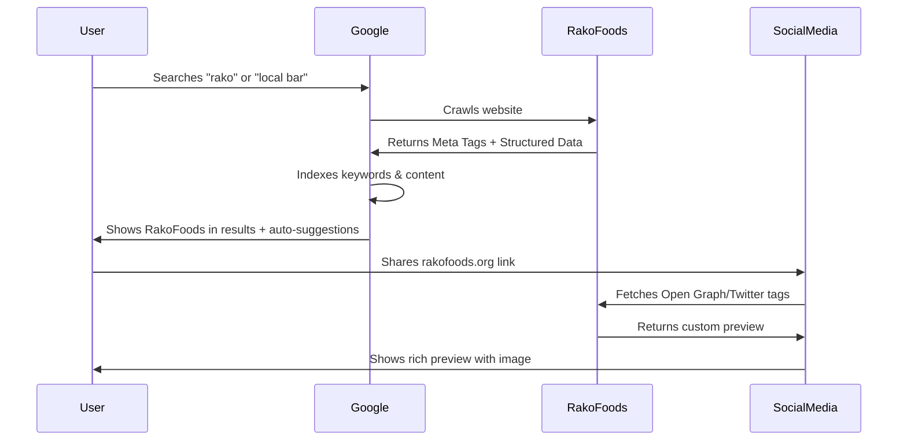
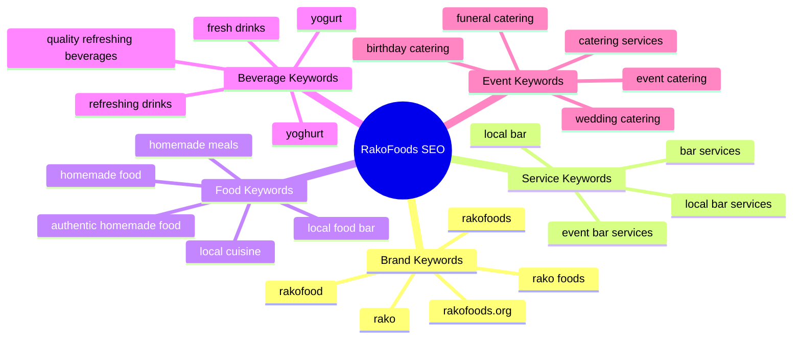
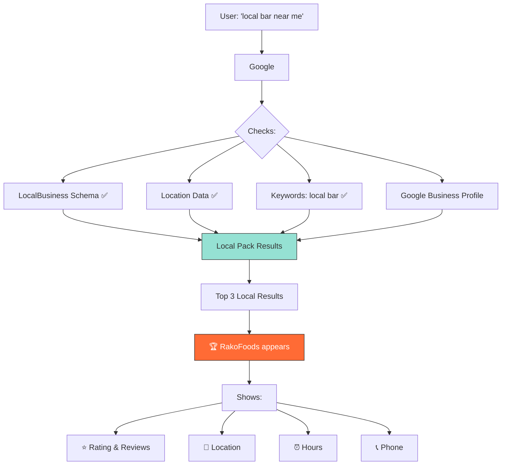

# RakoFoods SEO Architecture

```mermaid
graph TD
    A[RakoFoods Website] --> B[Meta Tags]
    A --> C[Social Media Tags]
    A --> D[Structured Data]
    A --> E[Technical SEO]
    
    B --> B1[Title: Rako Foods | Local Bar...]
    B --> B2[Description with Keywords]
    B --> B3[26 Target Keywords]
    B --> B4[Author & Publisher Info]
    
    C --> C1[Open Graph - Facebook/LinkedIn/WhatsApp]
    C --> C2[Twitter Cards]
    C --> C3[Custom Preview Images]
    C --> C4[Social Handles: @rakofoods]
    
    D --> D1[Organization Schema]
    D --> D2[LocalBusiness Schema]
    D --> D3[FoodEstablishment Schema]
    D --> D4[WebSite Schema]
    D --> D5[Service Schema]
    
    E --> E1[Sitemap.xml]
    E --> E2[Robots.txt]
    E --> E3[Canonical URLs]
    E --> E4[Google Bot Settings]
    
    B3 --> K1[rako, rakofood, rakofoods]
    B3 --> K2[local bar]
    B3 --> K3[homemade food]
    B3 --> K4[refreshing drinks]
    B3 --> K5[yoghurt]
    B3 --> K6[event catering]
    
    D1 --> S1[Social Media Links]
    D1 --> S2[Contact Info]
    D1 --> S3[Logo & Branding]
    
    D2 --> L1[Local Search Optimization]
    D2 --> L2[Near Me Queries]
    D2 --> L3[Google Maps Integration]
    
    style A fill:#ff6b35,stroke:#333,stroke-width:4px,color:#fff
    style B fill:#f7931e,stroke:#333,stroke-width:2px
    style C fill:#4ecdc4,stroke:#333,stroke-width:2px
    style D fill:#95e1d3,stroke:#333,stroke-width:2px
    style E fill:#38ada9,stroke:#333,stroke-width:2px
```

## SEO Data Flow



## Keyword Coverage Map



## Search Result Journey

```mermaid
graph LR
    A[User Types 'rako'] --> B{Google Autocomplete}
    B --> C[Suggests: Rako Foods]
    C --> D[User Clicks]
    D --> E[Search Results Page]
    E --> F[Rich Snippet with:]
    F --> F1[⭐ Title: Rako Foods | Local Bar...]
    F --> F2[📝 Description with keywords]
    F --> F3[🔗 rakofoods.org]
    F --> F4[⚡ Site Links]
    F1 --> G[User Visits Website]
    
    style A fill:#fff,stroke:#333
    style C fill:#4ecdc4,stroke:#333
    style F fill:#95e1d3,stroke:#333
    style G fill:#ff6b35,stroke:#333,color:#fff
```

## Social Media Sharing Flow

```mermaid
graph TD
    A[User Shares Link] --> B{Platform?}
    B -->|Facebook| C[Fetches Open Graph Tags]
    B -->|Twitter| D[Fetches Twitter Card Tags]
    B -->|LinkedIn| E[Fetches Open Graph Tags]
    B -->|WhatsApp| F[Fetches Open Graph Tags]
    
    C --> G[Shows Preview:]
    D --> G
    E --> G
    F --> G
    
    G --> H[📸 Custom Image 1200x630]
    G --> I[📝 Rako Foods | Local Bar...]
    G --> J[💬 Description with keywords]
    G --> K[🔗 rakofoods.org]
    
    H --> L[User Clicks]
    I --> L
    J --> L
    K --> L
    
    style A fill:#fff,stroke:#333
    style G fill:#4ecdc4,stroke:#333
    style L fill:#ff6b35,stroke:#333,color:#fff
```

## Local Search Optimization



---

## Implementation Status

| Component | Status | File Location |
|-----------|--------|---------------|
| Meta Tags | ✅ Complete | `app/layout.tsx` |
| Keywords | ✅ Complete | `app/layout.tsx` |
| Open Graph | ✅ Complete | `app/layout.tsx` |
| Twitter Cards | ✅ Complete | `app/layout.tsx` |
| Structured Data | ✅ Complete | `app/components/StructuredData.tsx` |
| Sitemap | ✅ Complete | `app/sitemap.ts` |
| Robots.txt | ✅ Complete | `app/robots.ts` |
| Social Images | ⏳ Pending | `/public/images/` |
| Google Verification | ⏳ Pending | `app/layout.tsx` line 83 |
| Social Links | ⏳ Pending | `app/components/StructuredData.tsx` |

---

## Next Actions Priority

1. 🔴 **High Priority:** Create social media images (og-image.jpg, twitter-image.jpg)
2. 🟡 **Medium Priority:** Update social media links in StructuredData.tsx
3. 🟢 **After Deploy:** Set up Google Search Console & submit sitemap
4. 🟢 **After Deploy:** Create Google Business Profile
5. 🟢 **Ongoing:** Regular content updates with target keywords
